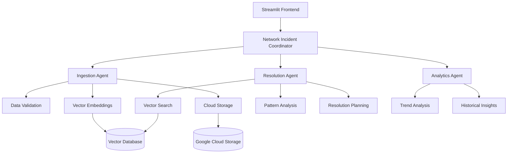

# 🤖 Agentic - AI-Powered Network Incident Management System

<div align="center">


*An intelligent multi-agent system for comprehensive network incident management, powered by Google Cloud Vertex AI and advanced vector search capabilities.*

[Features](#-features) • [Quick Start](#-quick-start) • [Architecture](#-architecture) • [Documentation](#-documentation) • [Examples](#-examples)

</div>

---

## 📋 Table of Contents

- [Overview](#-overview)
- [Features](#-features)
- [Architecture](#-architecture)
- [Quick Start](#-quick-start)
- [Installation](#-installation)
- [Configuration](#-configuration)
- [Usage Examples](#-usage-examples)
- [API Reference](#-api-reference)
- [Frontend Interface](#-frontend-interface)
- [Data Management](#-data-management)
- [Vector Search](#-vector-search)
- [Deployment](#-deployment)
- [Contributing](#-contributing)
- [License](#-license)

## 🌟 Overview

**Agentic** is a sophisticated AI-powered incident management system designed specifically for network operations teams. It combines the power of Google Cloud's Vertex AI with advanced vector search capabilities to provide intelligent incident resolution guidance based on historical patterns and proven solutions.

### 🎯 Core Capabilities

- **🤖 Intelligent Agent Coordination**: Multi-agent architecture with specialized roles
- **🔍 Vector-Powered Search**: Advanced similarity matching for incident patterns
- **📊 Historical Analysis**: Data-driven insights from past incident resolutions
- **⚡ Real-time Processing**: Instant incident ingestion and analysis
- **🎨 User-Friendly Interface**: Streamlit-based web interface for easy interaction
- **📈 Analytics & Insights**: Pattern recognition and trend analysis

## ✨ Features

### 🚀 Multi-Agent Architecture
- **NetworkIncidentCoordinatorAgent**: Main orchestrator routing requests intelligently
- **IncidentIngestionAgent**: Specialized data validation and storage operations
- **IncidentResolutionAgent**: Expert analysis and resolution guidance
- **AnalyticsAgent**: Advanced pattern recognition and insights

### 🔧 Advanced Tools
- **Smart Validation**: Comprehensive incident data format checking
- **Batch Processing**: Efficient handling of multiple incident records
- **Vector Embeddings**: AI-powered text representation for similarity matching
- **Context Retrieval**: Intelligent search across historical incident database
- **Pattern Analysis**: Automatic identification of recurring issues

### 🌐 Cloud Integration
- **Google Cloud Vertex AI**: Powered by Gemini 2.0 Flash model
- **Vector Search**: Google Cloud Matching Engine for similarity queries
- **Cloud Storage**: Scalable data persistence and backup
- **Authentication**: Secure Google Cloud credential management

## 🏗️ Architecture



### 🧩 Component Breakdown

| Component | Purpose | Key Features |
|-----------|---------|--------------|
| **Root Agent** | Request coordination and routing | Multi-agent orchestration, context management |
| **Ingestion Agent** | Data processing and storage | Validation, embeddings, batch processing |
| **Resolution Agent** | Incident analysis and guidance | Vector search, pattern matching, solution recommendations |
| **Analytics Agent** | Insights and trend analysis | Statistical analysis, pattern recognition |
| **Frontend** | User interface | Real-time chat, visualization, session management |

## ⚡ Quick Start

### 1. Clone the Repository
```bash
git clone https://github.com/xgenOsama/agentic.git
cd agentic
```

### 2. Set Up Environment
```bash
# Create virtual environment
python -m venv venv
source venv/bin/activate  # On Windows: venv\Scripts\activate

# Install dependencies
pip install -r backend/requirements.txt
```

### 3. Configure Google Cloud
```bash
# Set up authentication
gcloud auth application-default login

# Set project
gcloud config set project YOUR_PROJECT_ID
```

### 4. Create Environment Configuration
```bash
# Create .env file in backend directory
cp backend/.env.example backend/.env
# Edit with your specific configuration
```

### 5. Launch the Application
```bash
# Start the frontend
streamlit run Frontend/frontend.py
```

## 🛠️ Installation

### Prerequisites

- **Python 3.8+**
- **Google Cloud Project** with Vertex AI enabled
- **Vector Search Index** configured in Google Cloud
- **Storage Bucket** for data persistence

### Detailed Setup

1. **Install Python Dependencies**
   ```bash
   pip install -r backend/requirements.txt
   ```

2. **Google Cloud Services Setup**
   ```bash
   # Enable required APIs
   gcloud services enable aiplatform.googleapis.com
   gcloud services enable storage.googleapis.com
   gcloud services enable compute.googleapis.com
   ```

3. **Vector Search Configuration**
   ```bash
   # Create vector search index (via Google Cloud Console)
   # Note the index ID and endpoint ID for configuration
   ```

## ⚙️ Configuration

### Environment Variables

Create a `.env` file in the `backend/` directory:

```env
# Google Cloud Configuration
GOOGLE_CLOUD_PROJECT=your-project-id
GOOGLE_CLOUD_LOCATION=europe-west1
GOOGLE_CLOUD_QUOTA_PROJECT_ID=your-project-id

# AI Model Configuration
MODEL=gemini-2.0-flash-001

# Vector Search Configuration
INDEX_ENDPOINT_ID=projects/your-project/locations/europe-west1/indexEndpoints/your-endpoint-id
DEPLOYED_INDEX_ID=your-deployed-index-id
INDEX_NAME=projects/your-project/locations/europe-west1/indexes/your-index-id

# Data Storage Configuration
EMBEDDINGS_FILE=embeddings_text.json
BUCKET_NAME=your-storage-bucket
```

### Vector Search Setup

1. **Create Index**:
   ```bash
   # Via gcloud CLI or Google Cloud Console
   gcloud ai indexes create \
     --display-name="incident-embeddings" \
     --description="Network incident vector embeddings" \
     --dimensions=768 \
     --distance-measure-type=COSINE_DISTANCE
   ```

2. **Deploy Index**:
   ```bash
   # Deploy to endpoint for real-time queries
   gcloud ai index-endpoints deploy-index ENDPOINT_ID \
     --deployed-index-id=incident-index \
     --index=INDEX_ID
   ```

## 💡 Usage Examples

### 1. Basic Incident Resolution

```python
from backend.agent import root_agent

# Query for incident resolution
response = root_agent.query(
    "We're experiencing 4G service outages in Manchester. Customers report complete loss of connectivity. How should we proceed?"
)
print(response)
```

### 2. Incident Data Ingestion

```python
from backend.ingestion_agent.tools import ingest_incident_data

# Single incident ingestion
incident = {
    "incident_id": "INC-2025001",
    "timestamp": "2025-09-10T14:30:00Z",
    "severity": "High",
    "service_impact": "4G Service Outage Manchester",
    "incident_description": "Complete 4G service outage affecting Manchester region with approximately 10,000 customers impacted",
    "resolution_steps": "1. Identified core router BGP session failure 2. Restarted BGP processes 3. Verified routing table restoration",
    "root_cause": "BGP session timeout due to fiber cut during construction work"
}

result = ingest_incident_data(incident)
print(result)
```

### 3. Batch Data Processing

```python
from backend.ingestion_agent.tools import batch_ingest_incidents

# Multiple incidents
incidents = [
    {
        "incident_id": "INC-2025002",
        "timestamp": "2025-09-10T15:45:00Z",
        "severity": "Medium",
        "service_impact": "DNS Resolution Delays",
        "incident_description": "Customers experiencing slow DNS resolution",
        "resolution_steps": "1. Identified DNS server high load 2. Redistributed traffic 3. Optimized cache settings",
        "root_cause": "DNS server capacity exceeded during peak hours"
    },
    # ... more incidents
]

summary = batch_ingest_incidents(incidents)
print(summary)
```

### 4. Vector Search Analysis

```python
from backend.resoltuion_agent.tools import retrieve_context_from_query

# Search for similar incidents
query = "packet loss Glasgow network performance"
similar_incidents = retrieve_context_from_query(query, num_neighbors=10)

for incident in similar_incidents:
    print(f"Similar incident: {incident['incident_id']}")
    print(f"Resolution: {incident['resolution_steps']}")
```

## 📚 API Reference

### Core Agents

#### NetworkIncidentCoordinatorAgent
```python
# Main orchestrator agent
root_agent.query(message: str) -> str
root_agent.create_session(user_id: str) -> Session
```

#### IncidentIngestionAgent
```python
# Data management functions
validate_incident_format(incident_data: Dict) -> str
ingest_incident_data(incident_data: Union[Dict, List[Dict]]) -> str
batch_ingest_incidents(incidents_list: List[Dict]) -> str
test_ingestion_setup() -> str
```

#### IncidentResolutionAgent
```python
# Analysis and resolution functions
retrieve_context_from_query(query: str, num_neighbors: int = 10) -> List[Dict]
analyze_incident_patterns(incidents: List[Dict]) -> Dict
suggest_resolution_steps(context: str, incident_info: Dict) -> str
```

### Data Structures

#### Incident Record Format
```python
{
    "incident_id": str,          # Unique identifier (INC-XXXX format)
    "timestamp": str,            # ISO 8601 format
    "severity": str,             # Low, Medium, High, Critical
    "service_impact": str,       # Affected service description
    "incident_description": str, # Detailed problem description
    "resolution_steps": str,     # Actions taken to resolve
    "root_cause": str           # Underlying cause analysis
}
```

## 🎨 Frontend Interface

### Streamlit Web Application

The system includes a modern web interface built with Streamlit:

#### Features
- **💬 Chat Interface**: Natural language interaction with agents
- **🔄 Session Management**: Multiple conversation threads
- **📊 Real-time Updates**: Live status and progress indicators
- **🎯 Agent Initialization**: Lazy loading for optimal performance
- **📋 History Tracking**: Conversation persistence and recall

#### Launching the Frontend
```bash
streamlit run Frontend/frontend.py
```

#### Interface Components
- **Agent Status Indicator**: Shows initialization and health status
- **Chat Messages**: Interactive conversation with AI agents
- **Session Controls**: Create new sessions or continue existing ones
- **Error Handling**: Graceful error display and recovery options

## 📊 Data Management

### Vector Embeddings

The system uses Google's `text-embedding-004` model to generate high-dimensional vector representations of incident data:

```python
# Embedding generation process
def prepare_incident_text(incident_data: Dict[str, Any]) -> str:
    """Convert incident data to searchable text format"""
    text_parts = [
        f"Incident ID: {incident_data['incident_id']}",
        f"Severity: {incident_data['severity']}",
        f"Service Impact: {incident_data['service_impact']}",
        f"Description: {incident_data['incident_description']}",
        f"Resolution Steps: {incident_data['resolution_steps']}",
        f"Root Cause: {incident_data['root_cause']}"
    ]
    return " | ".join(text_parts)
```

### Storage Architecture

- **Local Storage**: JSON files for development and backup
- **Google Cloud Storage**: Scalable cloud persistence
- **Vector Database**: Google Cloud Matching Engine for similarity search
- **Metadata Management**: Structured data with searchable attributes

### Data Quality Assurance

```python
# Validation process
def validate_incident_format(incident_data: Dict[str, Any]) -> str:
    """Comprehensive data validation with detailed error reporting"""
    # - Required field validation
    # - Format compliance checking
    # - Business rule validation
    # - Data consistency verification
```

## 🔍 Vector Search

### Search Strategies

The system employs multiple search approaches for comprehensive incident matching:

#### 1. Service-Based Search
```python
# Target specific service types
query = "4G Service Outage Manchester"
results = retrieve_context_from_query(query)
```

#### 2. Symptom-Based Search
```python
# Find similar technical symptoms
query = "packet loss performance degradation"
results = retrieve_context_from_query(query)
```

#### 3. Component-Based Search
```python
# Locate infrastructure-specific issues
query = "BGP session router failure"
results = retrieve_context_from_query(query)
```

#### 4. Geographic Search
```python
# Region-specific incident patterns
query = "network issues Glasgow Scotland"
results = retrieve_context_from_query(query)
```

### Search Optimization

- **Progressive Strategy**: Multiple targeted searches for comprehensive coverage
- **Context Validation**: Relevance scoring and filtering
- **Neighbor Selection**: Configurable result count (default: 10)
- **Query Enhancement**: Automatic synonym expansion and context enrichment

## 🚀 Deployment

### Local Development
```bash
# Start development server
streamlit run Frontend/frontend.py --server.port 8501
```

### Google Cloud Deployment

#### 1. App Engine Deployment
```yaml
# app.yaml
runtime: python39
env: standard

env_variables:
  GOOGLE_CLOUD_PROJECT: "your-project-id"
  GOOGLE_CLOUD_LOCATION: "europe-west1"

automatic_scaling:
  min_instances: 1
  max_instances: 10
```

#### 2. Cloud Run Deployment
```dockerfile
FROM python:3.9-slim

WORKDIR /app
COPY requirements.txt .
RUN pip install -r requirements.txt

COPY . .
EXPOSE 8501

CMD ["streamlit", "run", "Frontend/frontend.py", "--server.port=8501", "--server.address=0.0.0.0"]
```

#### 3. Kubernetes Deployment
```yaml
apiVersion: apps/v1
kind: Deployment
metadata:
  name: agentic-deployment
spec:
  replicas: 3
  selector:
    matchLabels:
      app: agentic
  template:
    metadata:
      labels:
        app: agentic
    spec:
      containers:
      - name: agentic
        image: gcr.io/your-project/agentic:latest
        ports:
        - containerPort: 8501
```

### Environment-Specific Configuration

#### Development
```env
# Development settings
MODEL=gemini-2.0-flash-001
DEBUG=true
LOG_LEVEL=debug
```

#### Production
```env
# Production settings
MODEL=gemini-2.0-flash-001
DEBUG=false
LOG_LEVEL=info
MONITORING_ENABLED=true
```

## 🔧 Advanced Configuration

### Performance Tuning

#### Vector Search Optimization
```python
# Adjust search parameters for performance
SEARCH_CONFIG = {
    "num_neighbors": 10,           # Balance between accuracy and speed
    "timeout": 30,                 # Search timeout in seconds
    "cache_size": 1000,           # Result caching for frequent queries
    "parallel_searches": True      # Enable concurrent search execution
}
```

#### Memory Management
```python
# Embedding model configuration
EMBEDDING_CONFIG = {
    "batch_size": 100,            # Process embeddings in batches
    "model_cache": True,          # Cache model for repeated use
    "memory_limit": "2GB"         # Limit model memory usage
}
```

### Monitoring and Observability

#### Logging Configuration
```python
import logging

# Set up comprehensive logging
logging.basicConfig(
    level=logging.INFO,
    format='%(asctime)s - %(name)s - %(levelname)s - %(message)s',
    handlers=[
        logging.FileHandler('agentic.log'),
        logging.StreamHandler()
    ]
)
```

#### Metrics Collection
```python
# Track key performance metrics
METRICS = {
    "incident_processing_time": [],
    "search_accuracy_scores": [],
    "resolution_success_rates": [],
    "system_response_times": []
}
```

## 🧪 Testing

### Unit Tests
```bash
# Run unit tests
python -m pytest test/ -v
```

### Integration Tests
```bash
# Test Google Cloud integration
python -m pytest test/test_gcp.py -v

# Test ingestion pipeline
python -m pytest test/test_ingestion.py -v

# Test validation logic
python -m pytest test/test_validation.py -v
```

### Performance Tests
```bash
# Load testing with sample data
python test/performance_test.py --incidents 1000 --concurrent 10
```

## 🔐 Security

### Authentication
- Google Cloud IAM integration
- Service account key management
- Secure credential storage

### Data Protection
- Encryption at rest and in transit
- Access control and audit logging
- PII data handling compliance

### Network Security
- VPC configuration for cloud resources
- Firewall rules for API access
- SSL/TLS for all communications

## 📈 Monitoring

### Health Checks
```python
# System health monitoring
def health_check():
    checks = {
        "embedding_model": test_embedding_model(),
        "vector_search": test_vector_search(),
        "cloud_storage": test_cloud_storage(),
        "database_connection": test_database()
    }
    return all(checks.values())
```

### Performance Metrics
- Response time tracking
- Search accuracy measurement
- Resource utilization monitoring
- Error rate analysis

## 🤝 Contributing

We welcome contributions to improve the Agentic system! Please follow our contribution guidelines:

### Development Setup
1. Fork the repository
2. Create a feature branch
3. Make your changes
4. Add tests for new functionality
5. Submit a pull request

### Code Standards
- Follow PEP 8 style guidelines
- Include comprehensive docstrings
- Add unit tests for new features
- Update documentation as needed

### Issue Reporting
Please use the GitHub issue tracker to report bugs or request features. Include:
- Detailed description of the issue
- Steps to reproduce
- Expected vs actual behavior
- System environment details

## 📄 License

This project is licensed under the MIT License - see the [LICENSE](LICENSE) file for details.

## 🙏 Acknowledgments

- **Google Cloud Platform** for providing robust AI and cloud infrastructure
- **Streamlit** for the excellent web application framework
- **Open Source Community** for the amazing tools and libraries that make this project possible

---

<div align="center">

**Built with ❤️ for network operations teams worldwide**

[Report Bug](https://github.com/xgenOsama/agentic/issues) • [Request Feature](https://github.com/xgenOsama/agentic/issues) • [Documentation](https://github.com/xgenOsama/agentic/wiki)

</div>